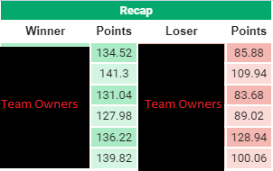
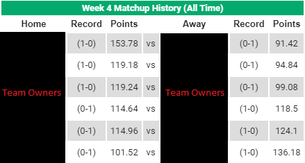
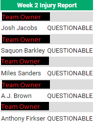

# Fantasy Football Assistant

## Purpose
This project is used as a reporting service for ESPN fantasy football leagues. 

### Previous Week Recap

This report compiles results from last week's matchups. 

### Matchup Preview

This report displays all time head to head records for the current week's matchups.

### Injury Report

This report displays all players currently in starting lineups with an injury designation 

## Prerequisites
### AWS Version
* [AWS Free Account](https://portal.aws.amazon.com/billing/signup?refid=em_127222&redirect_url=https%3A%2F%2Faws.amazon.com%2Fregistration-confirmation#/start)
### Terminal Version
* [node.js](https://nodejs.org/en/download/)

## Instructions 

### AWS Version
Use cloudwatch event with the following cron as a trigger: cron(0 10 ? * TUE,THU,SUN *)
### Terminal Version
